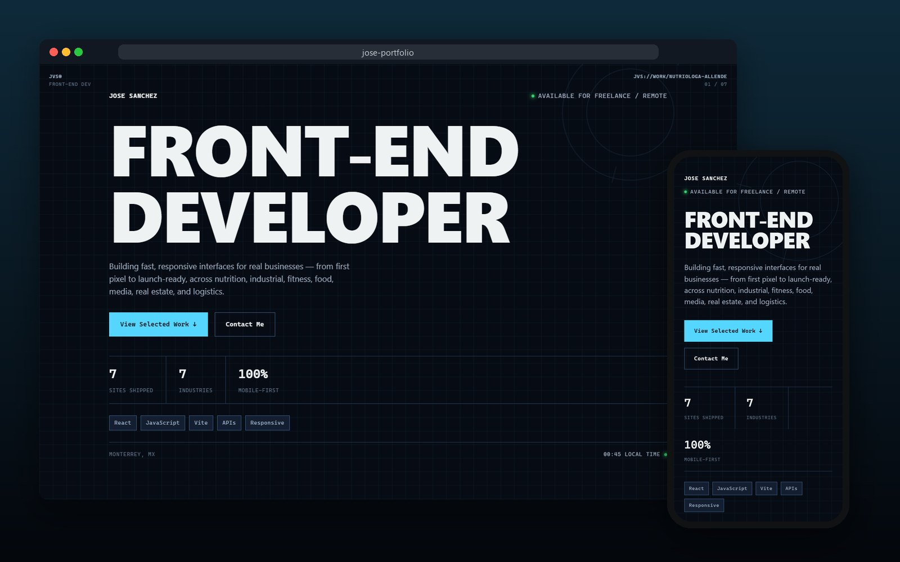

<div align="center">

# Jose Sanchez — Front-End Developer

**Fast, responsive interfaces for real businesses, from first pixel to launch-ready.**<br>
Portfolio covering nutrition, industrial, fitness, food, e-commerce, media, real estate and logistics.

<br>

[](mailto:devilfruitd3v@proton.me)


<br>



</div>

<br>

##  What's on the page

| | |
|---|---|
|  **Intro sequence** | Plays once, then reveals the **corner frame**, a fixed overlay that tracks the active project and links to the others. |
|  **Hero** | Live local clock, magnetic buttons, and quick stats. |
|  **Work index + case studies** | One section per project, all driven by `src/data/projects.js`. Each shows a real screenshot, or a styled mini-page mock when there's no screenshot yet. |
|  **How I Build** | The process, placed between the case studies. |
|  **Labs** | "Things I built to understand how they work." |
|  **Motion-aware** | Scroll reveals via `useInView` / `useActiveSection`, turned off for `prefers-reduced-motion`. |

##  Add or update a project

Edit `src/data/projects.js`. Each entry sets:

| Field | Purpose |
|---|---|
| `name`, `category`, `blurb`, `tags` | Card content |
| `status` | `live` or `soon` |
| `url`, `screenshot` | Live link and image (screenshots go in `public/screenshots/`) |
| `accent`, `accent2`, `theme` | Per-project colors |
| `mock` | Mini-page shown until a screenshot exists |

##  Run locally

```bash
npm install
npm run dev       # dev server
npm run build     # production build → dist/
npm run preview   # serve the build
```

##  Project structure

```
index.html                 Page shell + meta
src/
  main.jsx · App.jsx       Entry + page composition
  index.css                All styles
  data/projects.js         Case studies (the single source of project content)
  data/growth.js           Labs, skills and "currently building" content
  components/              Hero, WorkIndex, ProjectSection, CornerFrame, IntroSequence,
                           HowIBuild, LabsSection, Footer, Magnetic, StickyNav, …
  hooks/                   useInView, useActiveSection, useLocalClock, useReducedMotion
public/screenshots/        Live-site screenshots
docs/                      README preview
DESK_MODE_PLAN.md          Plan for an optional "desktop OS" mode (not built yet)
```

> [!NOTE]
> Some components aren't mounted in `App.jsx` right now (`GainzTakeover`, `GsapJoke`, `CurrentlyBuildingSection`, `WhatIUseSection`). They're kept so they can be brought back later.

##  Deployment

`npm run build` produces a static `dist/` folder, which can go on any static host (Netlify, Vercel, GitHub Pages).
